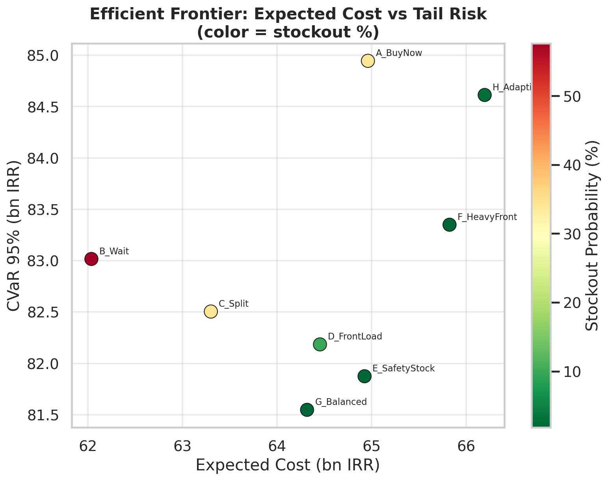
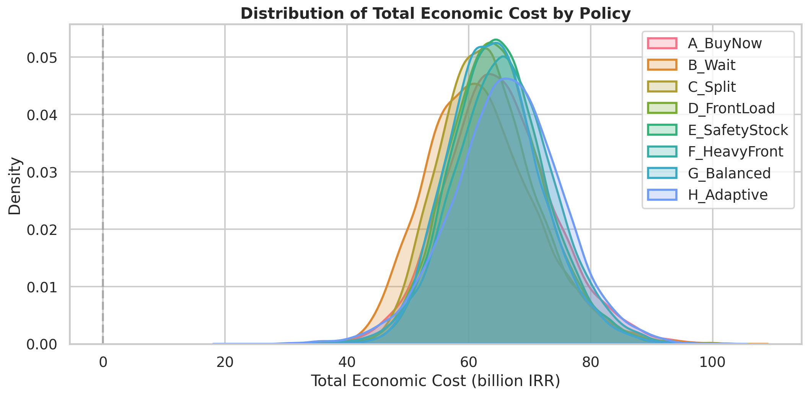

# Coffee Import Procurement under Uncertainty

**Decision-Making System for an Iranian Coffee Importer**

[](https://www.python.org/)
[](LICENSE)
[]()


A Monte Carlo decision engine for optimizing 3-month coffee procurement under joint uncertainty in:

- Global coffee price (GBP)
- IRR exchange rate
- Market demand (with price elasticity)

The system evaluates both **fixed** and **adaptive (MPC-style)** policies on 10 000 correlated scenarios and reports the full risk profile: Expected Cost, VaR, CVaR, Stockout probability, inventory trajectories and cost decomposition.

---

## Why this is not a simple forecast

> Best Forecast ≠ Best Decision

A single-point forecast of next-month coffee price is almost useless for procurement.  
What matters is the **distribution of economic outcomes** across thousands of plausible futures, the **tail risk (CVaR)** and the **probability of stock-out**.

This repository implements exactly that.

---

## Key Features

| Feature | Implementation |
|---------|----------------|
| Joint scenarios | Correlated GBM calibrated on real Farvardin–Tir 1401 market data (no look-ahead) |
| Price → Demand | Constant elasticity ε = −0.45 |
| Inventory economics | Full mark-to-market + financing on market value → captures Iranian inflation/FX appreciation |
| Fixed policies | Buy-Now, Wait, Split, Front-Load, Safety-Stock, … |
| Adaptive policy | Month-by-month re-optimisation (Model-Predictive heuristic) |
| Risk metrics | E[Cost], Median, VaR₉₅, CVaR₉₅, Stockout %, cash exposure |
| Visualisation | Distribution KDE, efficient frontier, inventory fan charts, cost waterfall |
| Accounting | Locked formula that avoids double-counting |

**Accounting identity used throughout**







```
TotalEconomicCost =
    Cash Procurement
  + Emergency Procurement (premium 20 %)
  + Physical Holding Cost
  + Financing (cost of capital on market value)
  − Terminal Inventory Value (marked at final-month market price)
```

Because terminal value is marked to market, inventory held through a period of FX depreciation produces a real economic gain that can exceed the pure holding cost — an essential feature for Iranian importers.

---

## Quick Start

```bash
# 1. Install
pip install -r requirements.txt

# 2. Run the full experiment
python main.py

# 3. Inspect results
ls outputs/figures/
ls outputs/tables/
cat outputs/reports/executive_insights.md
```

All figures are publication-ready PNGs (180 dpi).  
Tables are both CSV and multi-sheet Excel.

---

## Project Layout

```
coffee-procurement-risk/
├── README.md
├── requirements.txt
├── config/
│   └── params.yaml          # all business & simulation parameters
├── data/                    # raw market series (USD, GBP, coffee)
├── src/
│   ├── data_loader.py
│   ├── scenario_generator.py
│   ├── simulator.py         # fixed + adaptive engines
│   ├── risk_metrics.py
│   └── visualization.py
├── main.py                  # end-to-end runner
└── outputs/
    ├── figures/             # 6 professional charts
    ├── tables/              # CSV + Excel + scenario sample
    └── reports/             # executive insights markdown
```

---

## Methodology Summary

1. **Historical calibration** (no leakage)  
   Daily log-returns of coffee-GBP and GBP-IRR from the supplied ODS file are used to estimate μ, σ and correlation.

2. **Scenario generation**  
   10 000 monthly paths via correlated geometric Brownian motion.  
   Demand is then generated conditionally on the realised price path through constant elasticity.

3. **Inventory simulation**  
   Classic recursion with capacity constraints and emergency purchases at 20 % premium.

4. **Adaptive policy**  
   At the start of each month the agent observes current inventory and current price, forecasts remaining elastic demand, adds a safety-stock buffer and buys the shortfall (subject to warehouse capacity).

5. **Risk evaluation**  
   Full empirical distribution → Expected Cost, VaR, Conditional VaR, stock-out probability, cash usage.

6. **Robustness**  
   Results are stable under modest changes of elasticity, safety-stock target and cost-of-capital rate.

---

## Interpreting the Efficient Frontier

The scatter of Expected Cost vs CVaR (coloured by stock-out probability) shows the classic risk-return trade-off:

- Policies that wait for lower prices improve average cost but explode tail risk and stock-outs.
- Policies that front-load purchases (or the adaptive policy) pay a small premium in expected cost for a large reduction in CVaR and near-zero stock-out probability.

Management can therefore pick the point on the frontier that matches the firm’s risk appetite and liquidity constraints.

---

## Extending the Model

Possible next steps (already prepared architecturally):

- Full stochastic dynamic programming / reinforcement learning for the adaptive policy
- Multi-origin / multi-grade coffee
- Explicit futures/options hedging layer
- Walk-forward back-test on longer history when more data become available
- Integration with live FX and coffee feeds

---

## Licence & Contact

Internal decision-support tool.  
All market data used for calibration are historical public series for the period Farvardin–Tir 1401.
